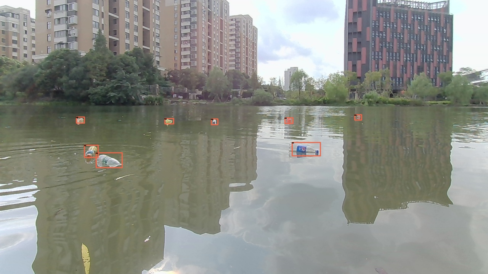
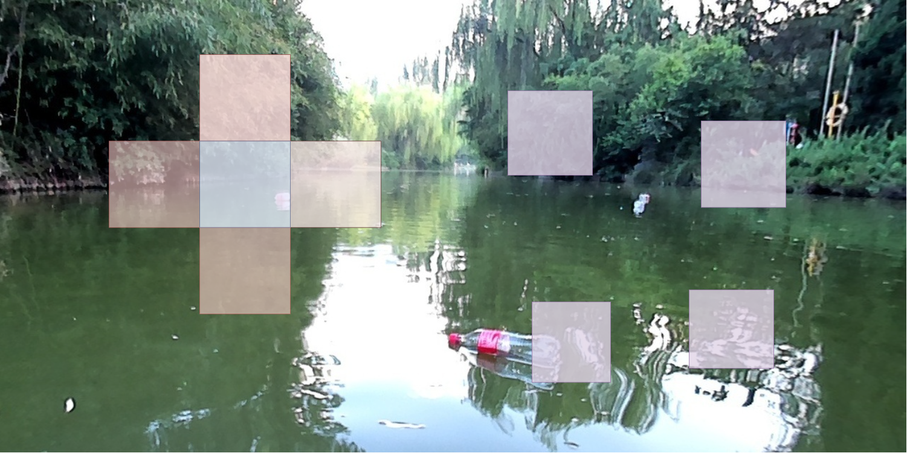

# YOLOX-S 目标检测

数据集为欧卡的 [FloW](http://www.orca-tech.cn/datasets/FloW/FloW-Img) 数据集，使用了 `mmdetection` 作为工具。

<p align="center">
    
    
</p>

- `coco-tools` 下面是将 `VOC` 格式的标注转 `json` 格式的标注
- `mmdetction` 是涉及的配置文件、结果和日志，把整个 `mmdetection` 提交上来没意思
- `crop-image` 是切割图片，用于预训练backbone，对应到自己的路径中。read_video 读取视频生成数据用于自监督训练

思路：考虑到算力和性能，选用单阶段 `YOLOX-s` 作为 `baseline`。**拒绝使用**竞赛常用的上分 trick，包括但不限于：模型融合、大规模 backbone 如 swin、cascade faster rcnn、各种策略组合。

### baseline

```log
 Average Precision  (AP) @[ IoU=0.50:0.95 | area=   all | maxDets=100 ] = 0.325
 Average Precision  (AP) @[ IoU=0.50      | area=   all | maxDets=1000 ] = 0.752
 Average Precision  (AP) @[ IoU=0.75      | area=   all | maxDets=1000 ] = 0.218
 Average Precision  (AP) @[ IoU=0.50:0.95 | area= small | maxDets=1000 ] = 0.197
 Average Precision  (AP) @[ IoU=0.50:0.95 | area=medium | maxDets=1000 ] = 0.461
 Average Precision  (AP) @[ IoU=0.50:0.95 | area= large | maxDets=1000 ] = 0.525
 Average Recall     (AR) @[ IoU=0.50:0.95 | area=   all | maxDets=100 ] = 0.413
 Average Recall     (AR) @[ IoU=0.50:0.95 | area=   all | maxDets=300 ] = 0.413
 Average Recall     (AR) @[ IoU=0.50:0.95 | area=   all | maxDets=1000 ] = 0.413
 Average Recall     (AR) @[ IoU=0.50:0.95 | area= small | maxDets=1000 ] = 0.317
 Average Recall     (AR) @[ IoU=0.50:0.95 | area=medium | maxDets=1000 ] = 0.536
 Average Recall     (AR) @[ IoU=0.50:0.95 | area= large | maxDets=1000 ] = 0.578
```

# 调优

## 策略一，Center Loss 预训练 backbone

不使用 COCO 预训练的经验，而是针对这个问题预训练 `backbone`，而这个 `backbone` 能有效识别前景和背景。

```log
 Average Precision  (AP) @[ IoU=0.50:0.95 | area=   all | maxDets=100 ] = 0.350
 Average Precision  (AP) @[ IoU=0.50      | area=   all | maxDets=1000 ] = 0.781
 Average Precision  (AP) @[ IoU=0.75      | area=   all | maxDets=1000 ] = 0.263
 Average Precision  (AP) @[ IoU=0.50:0.95 | area= small | maxDets=1000 ] = 0.224
 Average Precision  (AP) @[ IoU=0.50:0.95 | area=medium | maxDets=1000 ] = 0.492
 Average Precision  (AP) @[ IoU=0.50:0.95 | area= large | maxDets=1000 ] = 0.506
 Average Recall     (AR) @[ IoU=0.50:0.95 | area=   all | maxDets=100 ] = 0.452
 Average Recall     (AR) @[ IoU=0.50:0.95 | area=   all | maxDets=300 ] = 0.452
 Average Recall     (AR) @[ IoU=0.50:0.95 | area=   all | maxDets=1000 ] = 0.452
 Average Recall     (AR) @[ IoU=0.50:0.95 | area= small | maxDets=1000 ] = 0.363
 Average Recall     (AR) @[ IoU=0.50:0.95 | area=medium | maxDets=1000 ] = 0.569
 Average Recall     (AR) @[ IoU=0.50:0.95 | area= large | maxDets=1000 ] = 0.587
```

<details><summary>具体细节</summary>

我发现 `baseline` 的精度和召回率不是很好，那么有没有一种简单的提升方法呢？我能想到的就是 `backbone` 能不能不使用 COCO 预训练的经验，而是针对这个问题预训练 `backbone`，而这个 `backbone` 能有效识别前景和背景。

阅读源码发现实现预训练的 `backbone` 并不难，`mmdetection/tools` 下：

- `center_loss.py`，针对召回率提升较小，读了 `YOLOX` 的源代码并分析了下原因，认为是 `backbone` 提取的前背景特征区分度不明显，导致后面的 `neck` 和 `head` 可能认为背景特征是前景，前景特征是背景。于是使用 `center loss` 增加表示的区分度。区分前背景的精度为 96.67%，+5.3% mAP, +3.2% mAR。消融实验显示 center loss 好于单独的 cross entropy loss。
- `pretrain.py`，检测时加载 `backbone`
</details>


## 策略二，CIoU Loss 修正 SimOTA 的缺陷

```log
 Average Precision  (AP) @[ IoU=0.50:0.95 | area=   all | maxDets=100 ] = 0.379
 Average Precision  (AP) @[ IoU=0.50      | area=   all | maxDets=1000 ] = 0.835
 Average Precision  (AP) @[ IoU=0.75      | area=   all | maxDets=1000 ] = 0.291
 Average Precision  (AP) @[ IoU=0.50:0.95 | area= small | maxDets=1000 ] = 0.248
 Average Precision  (AP) @[ IoU=0.50:0.95 | area=medium | maxDets=1000 ] = 0.515
 Average Precision  (AP) @[ IoU=0.50:0.95 | area= large | maxDets=1000 ] = 0.561
 Average Recall     (AR) @[ IoU=0.50:0.95 | area=   all | maxDets=100 ] = 0.461
 Average Recall     (AR) @[ IoU=0.50:0.95 | area=   all | maxDets=300 ] = 0.461
 Average Recall     (AR) @[ IoU=0.50:0.95 | area=   all | maxDets=1000 ] = 0.461
 Average Recall     (AR) @[ IoU=0.50:0.95 | area= small | maxDets=1000 ] = 0.368
 Average Recall     (AR) @[ IoU=0.50:0.95 | area=medium | maxDets=1000 ] = 0.581
 Average Recall     (AR) @[ IoU=0.50:0.95 | area= large | maxDets=1000 ] = 0.617
```

<details><summary>具体细节</summary>

但是策略一的同时带来了一个问题，YOLOX-tiny 使用这种策略效果提升不明显，且 YOLOX-tiny 的检测效果优于 YOLOX-S 3.2%mAP，从源代码的角度分析了一下原因。

在一番阅读源码后，发现 YOLOX 的 SimOTA 机制在个小目标分配样本的时候存在一些漏洞，具体分析可以看仓库右侧的链接。简而言之，由于目标很小，选择的正样本和真实目标不相交，cls 和 obj 的损失没问题，但 reg 的损失恒定为 1，这不合理，使用 CIoU Loss 修正，效果提升也很明显。
</details>

## 策略三，无标签数据下使用自监督预训练

In `mmdetection/tools/ssl.py`: 

```log
 Average Precision  (AP) @[ IoU=0.50:0.95 | area=   all | maxDets=100 ] = 0.383
 Average Precision  (AP) @[ IoU=0.50      | area=   all | maxDets=1000 ] = 0.819
 Average Precision  (AP) @[ IoU=0.75      | area=   all | maxDets=1000 ] = 0.303
 Average Precision  (AP) @[ IoU=0.50:0.95 | area= small | maxDets=1000 ] = 0.247
 Average Precision  (AP) @[ IoU=0.50:0.95 | area=medium | maxDets=1000 ] = 0.525
 Average Precision  (AP) @[ IoU=0.50:0.95 | area= large | maxDets=1000 ] = 0.597
 Average Recall     (AR) @[ IoU=0.50:0.95 | area=   all | maxDets=100 ] = 0.472
 Average Recall     (AR) @[ IoU=0.50:0.95 | area=   all | maxDets=300 ] = 0.472
 Average Recall     (AR) @[ IoU=0.50:0.95 | area=   all | maxDets=1000 ] = 0.472
 Average Recall     (AR) @[ IoU=0.50:0.95 | area= small | maxDets=1000 ] = 0.378
 Average Recall     (AR) @[ IoU=0.50:0.95 | area=medium | maxDets=1000 ] = 0.589
 Average Recall     (AR) @[ IoU=0.50:0.95 | area= large | maxDets=1000 ] = 0.657
```

<details><summary>具体细节</summary>

现实世界中，并不是所有数据都有标签。那么如何利用好无标注数据呢？结合我之前看过的论文谈一下：

- 半监督目标检测，微软在 ICCV 2021 年发过一篇 SOTA 相关文章，但是其中调参复杂，且模型容量要翻倍，对非 RMB 玩家不友好
- 自监督领域的目标检测，DetCo 基于 Moco 改进的，Moco 的论文和代码我读过，非 RMB 玩家不友好，且 facebook AI 研究院出的 Moco 和 Simsiam 思路比较清奇且简单，但不容易让人接受。
- self-EMD 选用的 baseline 是 BYOL，里面的公式推导也比较 nice，但是早年的自监督网络结构令人劝退。

综上，有没有一种简单的自监督训练方法用到特定场景下的目标检测领呢？受到 self-EMD 的启发，我做了如下简单的工作：

<p align="center">
    
</p>

- 在图片中切出几个 patch，中间的蓝色视为 anchor，粉红色为正样本，紫色为负样本
- 使用余弦距离作为损失函数，anchor 和正样本的表示应该接近，anchor 和负样本的表示应该远离
- 考虑到目标检测受空间信息影响比较大，因此正样本的 patch 必须挨着 anchor

实验结果显示这种预训练的方式优于有标签的训练方式。这里只给出我的思考：对于有标签的训练方式，切图获得背景和目标，那么网络只认识背景和目标，抛出一张完整的图片，网络只对目标区域感兴趣；如果是自监督训练，那么网络认识的就是数据的分布，或者说图片该长什么样子，不会对某个区域特别感兴趣；但是当检测程序开始训练，需要对某些区域感兴趣时，网络就知道需要对哪些区域感兴趣，和感兴趣的区域相似的区域是哪些，不相似的区域是哪些，这样能更好的定位到目标。

</details>
