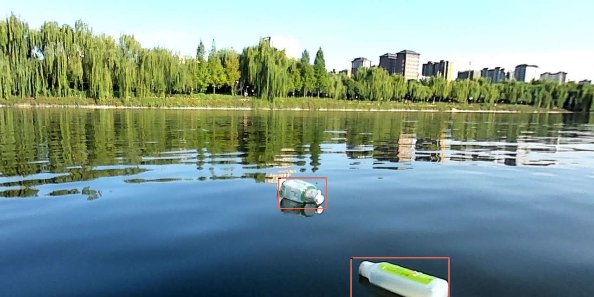

数据集为欧卡的 [FloW](http://www.orca-tech.cn/datasets/FloW/FloW-Img) 数据集，使用了 `mmdetection` 作为工具。

    
    

- `coco-tools` 下面是将 `VOC` 格式的标注转 `json` 格式的标注
- `mmdetction` 是涉及的配置文件，把整个 `mmdetection` 提交上来没意思
- [ ] 之后会研究一些自监督目标检测，因为现实世界中大量样本没有标注，尝试提升检测性能